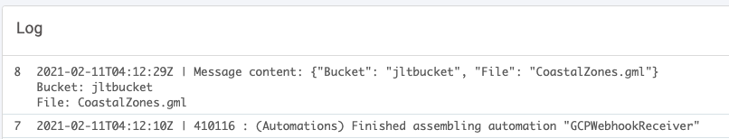

# Google Cloud Functions - Storage Account Create to Webhook

## Introduction

I did this becuase FME Server doesn't have a Google Storage watcher/trigger in Automations. I want to trigger a workspace to run when a new file is placed in a Google Storage Bucket.

## Prerequisite

A Google Storage Account

A Webhook Endpoint

Knowledge of Python (optional - I got by copying and pasting bits off StackOverflow)

## Use Case

This would useful for FME Server integration. The webhook in FME Server receives JSON, that will get passed to a workspace. When the workspace receives the JSON payload it will flatten it to get the file and bucket name which will get used in the Google Storage Connector transformer to download and read some data that will get process in FME (and ultimately uploaded to GBQ)

## Cloud Research & Outcome

To start with I found the [Google Cloud documentation for Google Cloud Storage Triggers](https://cloud.google.com/functions/docs/calling/storage#functions-calling-storage-python). I chose to use the python triggers as I assume more FME users would know python over node (which would have been my preference). Ultimately I'm building this project to demonstrate integration between GCP and FME (Server)

The next step was expanding the python code to be able to send a JSON message to my webhook endpoint (FME Server). This bit I had some trouble with. I found a [Stack Overflow thread](https://stackoverflow.com/questions/11322430/how-to-send-post-request) that I took pieces from several different answers.

I started with just importing requests, but found that the payload wasn't valid JSON, and FME Server was receiving/encoding it to base64. When I decoded it, it wasn't in the nice format I wanted. I then added the JSON module, and then added headers. Finally, FME Server would receive the data the way I wanted:

## Next Steps
Next I plan to build an FME Workspace that will take that JSON message, download/read in the data, process it, then write it to Google Big Query:

## Social Proof

[Tweet](https://twitter.com/mapgirll/status/1359749585644625920?s=21)
